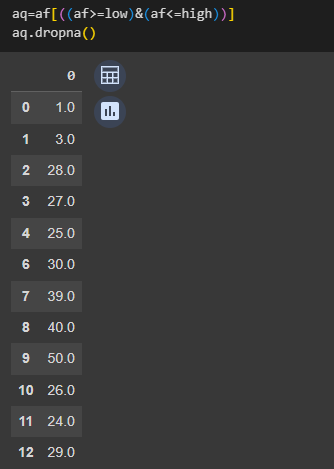

# EX:1 Data Cleaning Process

# AIM :
To read the given data and perform data cleaning and save the cleaned data to a file.

# Explanation :
Data cleaning is the process of preparing data for analysis by removing or modifying data that is incorrect ,incompleted , irrelevant , duplicated or improperly formatted. Data cleaning is not simply about erasing data ,but rather finding a way to maximize datasets accuracy without necessarily deleting the information.

# Algorithm :
STEP 1: Read the given Data

STEP 2: Get the information about the data

STEP 3: Remove the null values from the data

STEP 4: Save the Clean data to the file

STEP 5: Remove outliers using IQR

STEP 6: Use zscore of to remove outliers

# Coding and Output :
```
Developed by : R.SUDHIR KUMAR
Register number : 212223230221
```
```python
#reading csv file
import pandas as pd
df=pd.read_csv("/content/SAMPLEIDS.csv")
df
```

```python
#finding head and tail of the data
print(df.head(5))
print(df.tail(5))
```

```python
#checking null values
print(df.isnull())
```

```python
#filling null values with 0
print(df.fillna(0))
```

```python
#total no. of null in each columns
df.isnull().sum()
```

```python
# drop axis
df.dropna(axis=1)
```

```python
#describe
df.describe()
```


# 2) Outlier Detection and Removal

# AIM:
To read a given dataset and remove outliers and save a new dataframe.

# ALGORITHM:
(1) Remove outliers using IQR

(2) After removing outliers in step 1, you get a new dataframe.

(3) use zscore of 3 to remove outliers. This is quite similar to IQR and you will get exact same result

(4) for the data set height_weight.csv find the following

    (a) Using IQR detect weight outliers and print them

    (b) Using ZScore, detect height outliers and print them

# Coding and Output :

```
Developed by : R.SUDHIR KUMAR
Register number : 212223230221
```
# IQR
```python
import pandas as pd
import seaborn as sns
age=[1,3,28,27,25,92,30,39,40,50,26,24,29,94]
af=pd.DataFrame(age)
af
```

```python
sns.boxplot(data=af)
```

```python
sns.scatterplot(data=af)
```

```python
low=q1-1.5*iqr
low
high=q3+1.5*iqr
high
```

```python
aq=af[((af>=low)&(af<=high))]
aq.dropna()
```

```python
sns.boxplot(data=aq)
sns.scatterplot(data=aq)
```


# ZSCORE
```python
data = {'weight':[12,15,18,21,24,27,30,33,36,39,42,45,48,51,54,57,60,63,66,69,202,72,75,78,81,84,232,87,90,93,96,99,258]}
df=pd.DataFrame(data)
df
```

```python
sns.boxplot(data=df)
```

```python
z = np.abs(stats.zscore(df))
print(df[z['weight']>3])
```

```python
def d_o(val):
    ts=3
    m=np.mean(val)
    sd=np.std(val)
    for i in val:
        z=(i-m)/sd
        if np.abs(z)>ts:
            out.append(i)
        return out
op = d_o(val)
op
```

# Result :
Thus, the given data is read, cleansed and the cleaned data is saved into the file and the given data is read,remove outliers and save a new dataframe was created and executed successfully.
